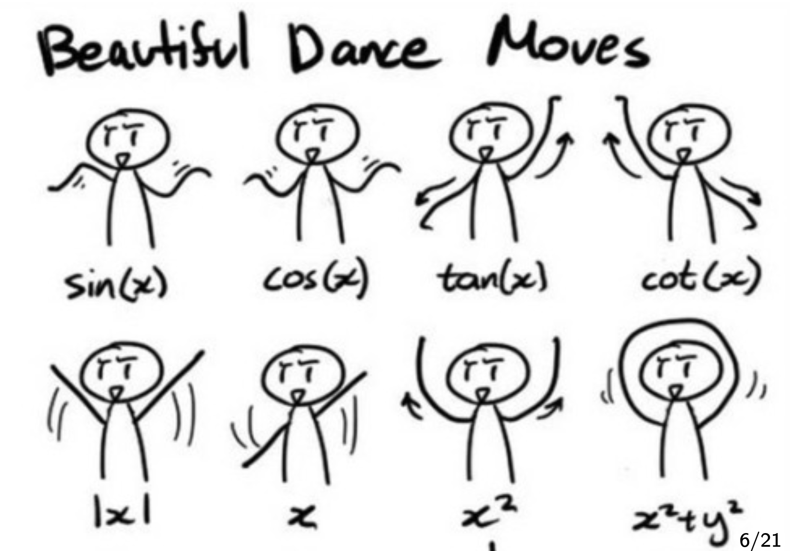
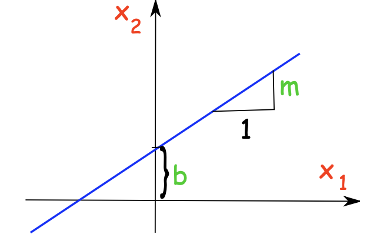
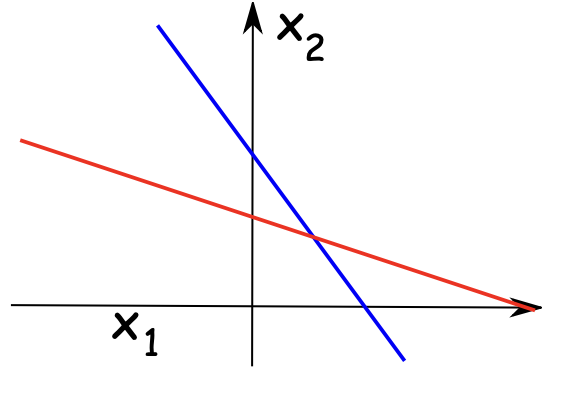
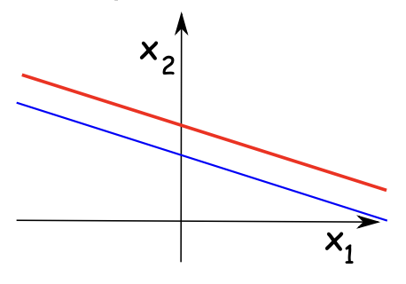
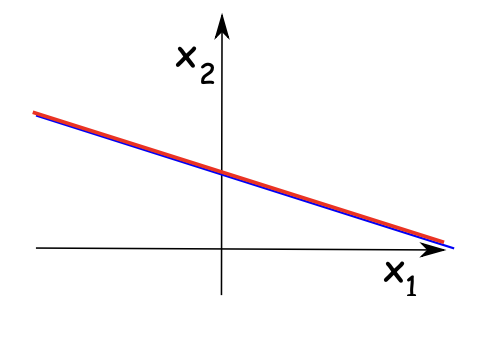

---

title: 'Linear Equations & Systems'
description: 'Notes on linear equations, solutions, systems, matrices, and Gaussian elimination (EROS), with geometric intuition and examples.'
date: 2025-10-03
tags: ['linear-algebra', 'lecture-1']
image: './banner.png'
authors: ['chara0x']
---------------------

import Callout from '@/components/Callout.astro'

## Introduction

These notes collect the core ideas from Lecture 1: what *linear* equations are, how to recognize and solve them, and how systems of such equations relate to geometry. 

---

## Linear equations

<Callout variant="definition" title="Linear Equation">
  A **linear equation** in variables $x_1,\dots,x_n$ has the form

  $$
  a_1x_1+a_2x_2+\cdots+a_nx_n=b,
  $$

  where all $a_i$ (and possibly $b$) are constants.
</Callout>

{/* add a image here with caption and smaller size*/}

*Figure1: None of those wave can be coefficient*

### Solutions 
<Callout variant="definition" title="Solution">
  A **solution** is a list $(s_1,\dots,s_n)$ such that substituting $(x_i=s_i)$ makes the equation true:

  $$
  a_1s_1+a_2s_2+\cdots+a_ns_n=b.
  $$
</Callout>

### Example
$$

0.1\cdot 90+0.15\cdot 75+0.15\cdot 85+0.6\cdot 95=90
$$
Hence $90,75,85,95$ is a solution of $0.1x_1+0.15x_2+0.15x_3+0.6x_4=90$ 

 

### Lines (two variables)

Starting with slope–intercept form $y=mx+b$
$$
y=mx+b \iff -mx+y=b
$$
which is a linear equation $a_1x_1+a_2x_2=b$ with $x_1=x$, $x_2=y$, $a_1=-m$, $a_2=1$

Thus any equation $a_1x_1+a_2x_2=b$ (with $(a_1,a_2)\neq(0,0)$) represents a **line** in the plane, and a pair $(s_1,s_2)$ is a solution iff the point lies on that line.

*Figure2: Linear Equation and Lines*

---

## Linear Eq. System

<Callout variant="definition" title="Linear System">
  A **system** of $m$ linear equations in $n$ variables is

  $$
  \begin{aligned}
  a_{11}x_1+a_{12}x_2+\cdots+a_{1n}x_n&=b_1 \\
  a_{21}x_1+a_{22}x_2+\cdots+a_{2n}x_n&=b_2 \\
  \vdots \\
  a_{m1}x_1+a_{m2}x_2+\cdots+a_{mn}x_n&=b_m
  \end{aligned}
  $$

  A **solution** is a list $s_1,\dots,s_n\in\mathbb{R}^n$ that satisfies *all* equations simultaneously.
</Callout>

### Geometric intuition

Each equation is a line; solving the system means **finding the intersection** of the lines.

**Example**
$$

\begin{cases}
x_1+2x_2=3,\\
2x_1+x_2=3
\end{cases}
\quad\Longrightarrow\quad (x_1,x_2)=(1,1).

$$
Three outcomes are possible for a system of linear equations:

* **No solution** (parallel, distinct lines) — **inconsistent**.

* **Exactly one solution** (lines intersect at one point).

* **Infinitely many solutions** (same line; solutions are **parameterized**). 

---

## Matrices for a system

Extract the numbers into matrices.

* **Coefficient matrix**
$$

  A=\begin{bmatrix}
  a_{11}&a_{12}&\cdots&a_{1n}\\
  a_{21}&a_{22}&\cdots&a_{2n}\\
  \vdots&\vdots&\ddots&\vdots\\
  a_{m1}&a_{m2}&\cdots&a_{mn}
  \end{bmatrix}
  $$
* **Augmented matrix**
$$
[A|\mathbf{b}]=
\left[
\begin{array}{cccc|c}
a_{11}&a_{12}&\cdots&a_{1n}&b_1\\
a_{21}&a_{22}&\cdots&a_{2n}&b_2\\
\vdots &\vdots &\ddots&\vdots &\vdots\\
a_{m1}&a_{m2}&\cdots&a_{mn}&b_m
\end{array}
\right]
$$
  
These capture all the information needed to solve the system. 

---

### Elementary Row Operations (EROS)

The following **row operations** do **not** change the solution set of a system:

1. **Row interchange**: swap two rows.
2. **Row scaling**: multiply a row by a nonzero constant $c$
3. **Row replacement**: replace a row by itself plus $c$ times another row.

Using EROS to simplify $[A|\mathbf{b}]$ is **Gaussian elimination** - Keep repeating this process until it's in reduced row-echelon form (RREF) to get solutions.

### Gaussian elimination

Solve
$$

\begin{cases}
x+2y=3\\
2x+y=3
\end{cases}
\quad\Longleftrightarrow\quad
\left[\begin{array}{cc|c}
1&2&3\\
2&1&3
\end{array}\right]
$$

Apply EROS:
$$

\begin{aligned}
R_2 \leftarrow R_2-2R_1&:
\left[\begin{array}{cc|c}
1&2&3\\
0&-3&-3
\end{array}\right]

\\

R_2 \leftarrow -\tfrac13 R_2&:
\left[\begin{array}{cc|c}
1&2&3\\
0&1&1
\end{array}\right]

\\

R_1 \leftarrow R_1-2R_2&:
\left[\begin{array}{cc|c}
1&0&1\\
0&1&1
\end{array}\right]

\end{aligned}

$$
Thus $x=1,\ y=1$ (unique solution).

---
## Summary

1. A linear equation $a_1x_1+\cdots+a_nx_n=b$ describes a **line** ($n=2$), a **plane** ($n=3$), or a **hyperplane** ($n>3$).
2. Solutions to a system are the **intersection** of these hyperplanes.
3. A system has **no solution**, **one solution**, or **infinitely many solutions**.
4. Use matrices and **EROS** (Gaussian elimination) to simplify to echelon / RREF and get solutions. 

---

> Adapted from the source lecture PDF. 

