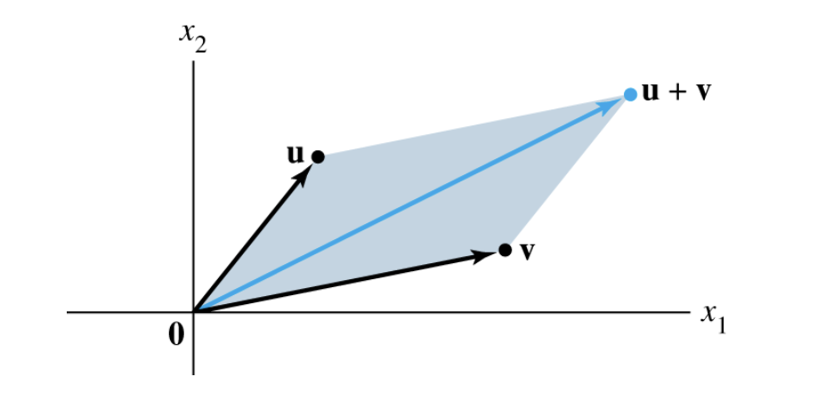
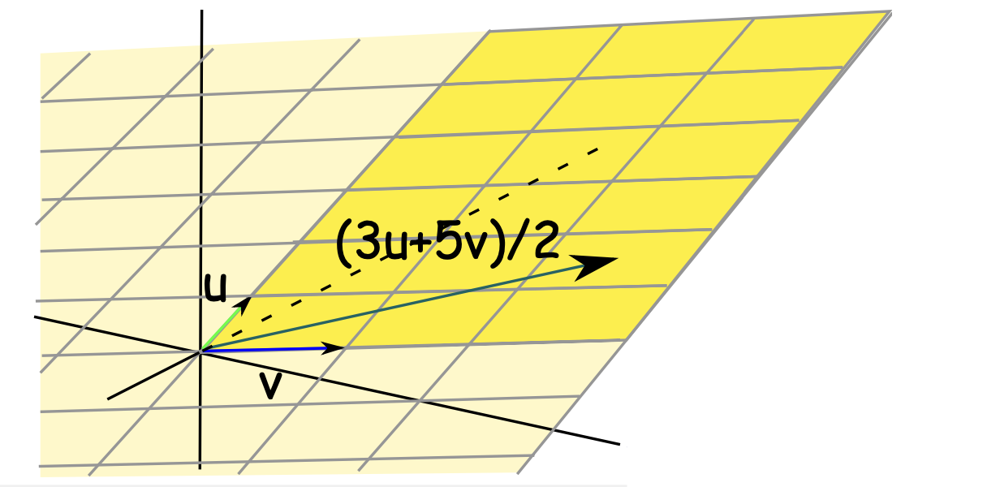
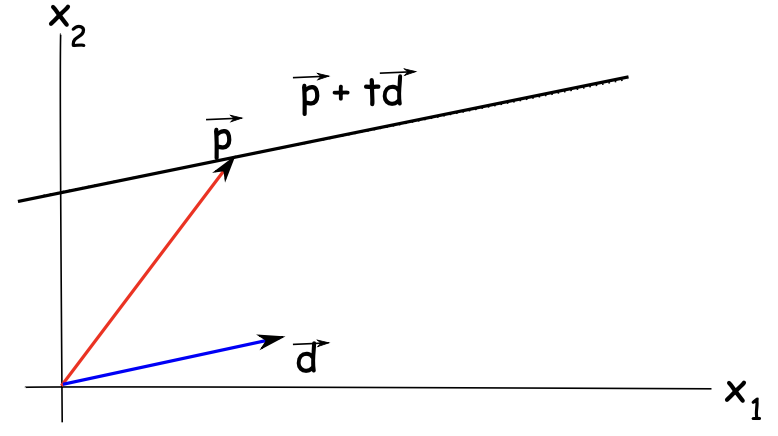

import Callout from '@/components/Callout.astro'
import { array } from 'astro:schema'

<Callout variant="note" title="Extra Reading">
  3Blue1Brown's linear algebra series for **Linear combinations, span, and basis vectors**. Start with this episode:

  

    <iframe
      src="https://www.youtube.com/embed/k7RM-ot2NWY?si=OzvgpPGa25BCLx3S"
      title="3Blue1Brown — Essence of Linear Algebra"
      class="absolute left-0 top-0 h-full w-full"
      frameborder="0"
      allow="accelerometer; autoplay; clipboard-write; encrypted-media; gyroscope; picture-in-picture; web-share"
      allowfullscreen
    ></iframe>
  

</Callout>

## Vector Equation

Given vectors $\{\vec{a}_1,\vec{a}_2,\dots,\vec{a}_n,\vec{b}\}$ in $\mathbb{R}^m$, determine if $\vec{b}$ is a **linear combination** of $\vec{a}_1,\dots,\vec{a}_n$

This is equivalent to solving the **vector equation**:
$$
x_1\vec{a}_1+\cdots+x_n\vec{a}_n=\vec{b}
$$

Which is the same as checking if the augmented matrix
$$
\left[\vec{a}_1\;\vec{a}_2\;\cdots\;\vec{a}_n\;|\;\vec{b}\right]
$$
has a solution (via EROS).

---

## Review

- $\vec{b}$ is a linear combination of $\vec{a}_1,\dots,\vec{a}_n$  
- The vector equation $x_1\vec{a}_1+\cdots+x_n\vec{a}_n=\vec{b}$ has a solution.  
- We answer this by reducing the augmented matrix to (reduced) echelon form.

### Example

Suppose
$$
\vec{a}_1=\begin{bmatrix}0\\2\\4\\8\end{bmatrix},\;\;
\vec{a}_2=\begin{bmatrix}0\\2\\4\\8\end{bmatrix},\;\;
\vec{a}_3=\begin{bmatrix}6\\-1\\1\\-1\end{bmatrix},\;\;
\vec{a}_4=\begin{bmatrix}0\\6\\10\\26\end{bmatrix},\;\;
\vec{b}=\begin{bmatrix}12\\4\\13\\23\end{bmatrix}
$$

We want $x_1\vec{a}_1+x_2\vec{a}_2+x_3\vec{a}_3+x_4\vec{a}_4=\vec{b}$

**Augmented matrix:**
$$
\begin{bmatrix}
0&0&6&0&|&12\\
2&2&-1&6&|&4\\
4&4&1&10&|&13\\
8&8&-1&26&|&23
\end{bmatrix}
$$

Row-reduce (EROS) to:
$$
\begin{bmatrix}
1&1&0&0&|&3/2\\
0&0&1&0&|&2\\
0&0&0&1&|&1/2\\
0&0&0&0&|&0
\end{bmatrix}
$$

The solution is a **one-dimensional general solution**
$$
x_1=\tfrac{3}{2}-s,\;\;x_2=s,\;\;x_3=2,\;\;x_4=\tfrac{1}{2}
$$

---

## From Vectors to Span

- Linear combinations involve adding vectors.  
- This is how we visualize addition of vectors:

*Figure 1: Vector addition visualization*

We often have to consider all possible linear combinations of a given collection of vectors.

In solving systems with infinitely many solutions, the solutions involve
$$
s\begin{bmatrix}-1\\1\\0\\0\\0\end{bmatrix}
+t\begin{bmatrix}-\pi\\0\\-e\\1\\0\end{bmatrix}
$$

for any choices of $s,t$

---

## Span

<Callout variant="definition" title="Span">
Given $\{\vec{v}_1,\vec{v}_2,\dots,\vec{v}_k\}$, the set of **all linear combinations**:
$$
c_1\vec{v}_1+\cdots+c_k\vec{v}_k,\quad c_i\in\mathbb{R}
$$
is called the **span** of $\{\vec{v}_1,\dots,\vec{v}_k\}$, denoted
$$
\text{Span}\{\vec{v}_1,\dots,\vec{v}_k\}
$$
</Callout>

If $k=1$ so there's only one vector, then $\text{Span}\{\vec{v}\}$ is just all vectors that are multiples of $\vec{v}$

i.e., $\{c\vec{v}\mid c\in\mathbb{R}\}$ (a line through $\vec{0}$ and $\vec{v}$).  

**Example**
The collection of vectors
$$
s\begin{bmatrix}-1\\1\\0\\0\\0\end{bmatrix}
+t\begin{bmatrix}-\pi\\0\\-e\\1\\0\end{bmatrix}
$$
for all possible choices of $s, t$ form the span
$$
\text{Span}\left\{
\begin{bmatrix}-1\\1\\0\\0\\0\end{bmatrix},
\begin{bmatrix}-\pi\\0\\-e\\1\\0\end{bmatrix}
\right\}
$$

### Visualization
Picture this span when $k=1,2$:
- $k=1$: span is a line through $\vec{0}$ and $\vec{v}$ → $ \text{Span}\{\vec{v}\}=\{c\vec{v}\} $
- $k=2$: span is $ \text{Span}\{\vec{u},\vec{v}\}=\{c_1\vec{u}+c_2\vec{v}\} $ (Figure 2)

*Figure 2: when $k=2$, Span = entire plane, $c_i > 0$ highlighted*

### Spanning Solutions

Back to example above:
$$
\begin{bmatrix}
\begin{array}{cccc|c}
0&0&6&0&&12\\
2&2&-1&6&&4\\
4&4&1&10&&13\\
8&8&-1&26&&23
\end{array}
\end{bmatrix}
\;\;\Rightarrow\;\;
\begin{bmatrix}
\begin{array}{cccc|c}
1&1&0&0&&3/2\\
0&0&1&0&&2\\
0&0&0&1&&1/2\\
0&0&0&0&&0
\end{array}
\end{bmatrix}

$$

General solution was
$$
x_1=\tfrac{3}{2}-t,\;\;x_2=t,\;\;x_3=2,\;\;x_4=\tfrac{1}{2}
$$

We can rewrite this as 
$$
\begin{bmatrix}c_1\\c_2\\c_3\\c_4\end{bmatrix}
=
\begin{bmatrix}3/2\\0\\2\\1/2\end{bmatrix}
+t\begin{bmatrix}-1\\1\\0\\0\end{bmatrix}
$$

So we can think of the set of **all solutions** as
$$
\begin{bmatrix}3/2\\0\\2\\1/2\end{bmatrix}
+\text{Span}\left\{\begin{bmatrix}-1\\1\\0\\0\end{bmatrix}\right\}
$$

where $\vec{p}=\begin{bmatrix}3/2\\0\\2\\1/2\end{bmatrix}$ is a point, and $\vec{d}=\begin{bmatrix}-1\\1\\0\\0\end{bmatrix}$ is the direction.

We can picture the solution as a line in the direction of the second vector, going through the point given by the first vector (In $\mathbb{R}^4$)

*Figure 3: Visualization of spanning solutoin

----